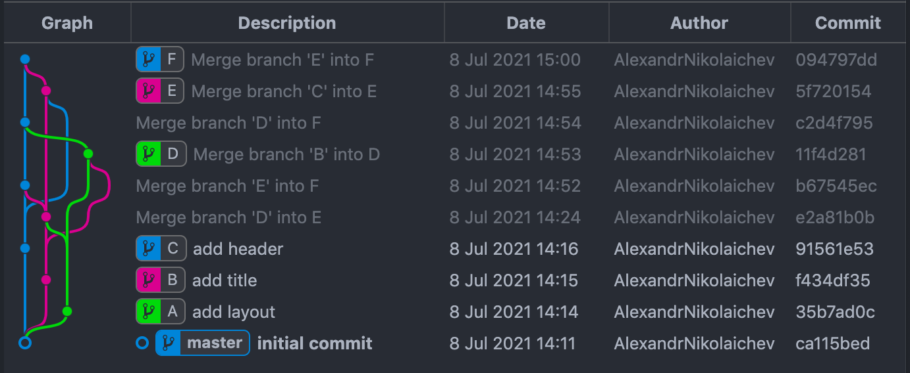

# 4. Последний общий коммит веток git

Необходимо написать функцию, которая на вход получает информацию о коммитах и массив из двух имён веток, а на выход отдаёт сообщение их последнего общего коммита.

### Структура коммита

```ts
// ? - необязательные поля (могут отсутствовать в объекте)
interface Commit {
    id: string; // уникальный идентификатор коммита
    timestamp: number; // время создания в миллисекундах
    parents?: string[]; // массив id родительских коммитов
    message?: string; // сообщение коммита
    branches?: string[]; // массив имён веток
}

```

Все коммиты имеют уникальные id, все id родительских коммитов соответствуют коммитам в массиве. В целом, считаем, что входные данные корректны и дополнительная их проверка не требуется.

### Шаблоны

```js
function getLastCommonCommitMessage(commits, branches) {
    // code here
};

module.exports = {getLastCommonCommitMessage};
```

### Иллюстрация

Для данного репозитория и веток ['D', 'E'] последний общий коммит f434df35 содержит сообщение add title. Хотя для этих двух веток коммиты 35b7ad0c и ca115bed также являются общими, но последний по времени именно f434df35.



### Примеры

```js
getLastCommonCommitMessage([
{
  id: '1',
  message: 'initial commit',
  timestamp: 1624010073113,
},
{
  id: '2',
  parents: ['1'],
  message: 'add layout',
  timestamp: 1624010082219,
},
{
  id: '3',
  parents: ['2'],
  message: 'fix bugs',
  timestamp: 1624010109039,
  branches: ['master', 'bugfix']
},
{
  id: '4',
  parents: ['2'],
  message: 'add link',
  timestamp: 1624010179662,
  branches: ['feature/link']
}
], ['bugfix', 'feature/link']) // 'add layout'
getLastCommonCommitMessage([{
  id: '1',
  message: 'initial commit',
  timestamp: 1624010073113,
  branches: ['master'],
}], ['master', 'master']) // 'initial commit'
getLastCommonCommitMessage([], ['ghost', 'bla-bla-bla-branch']) // Error('No common commit')
```

### Примечания

### Требования

* Найденный коммит должен быть последним по времени (если общих коммитов больше одного), то есть самым поздним. У всех коммитов гарантированно разное время;
* Массив id для родительских коммитов не упорядочен по времени их создания;
* При отсутствии поля message у коммита вернуть пустую строку '';
* При отсутствии общего коммита выбросить ошибку c message 'No common commit';