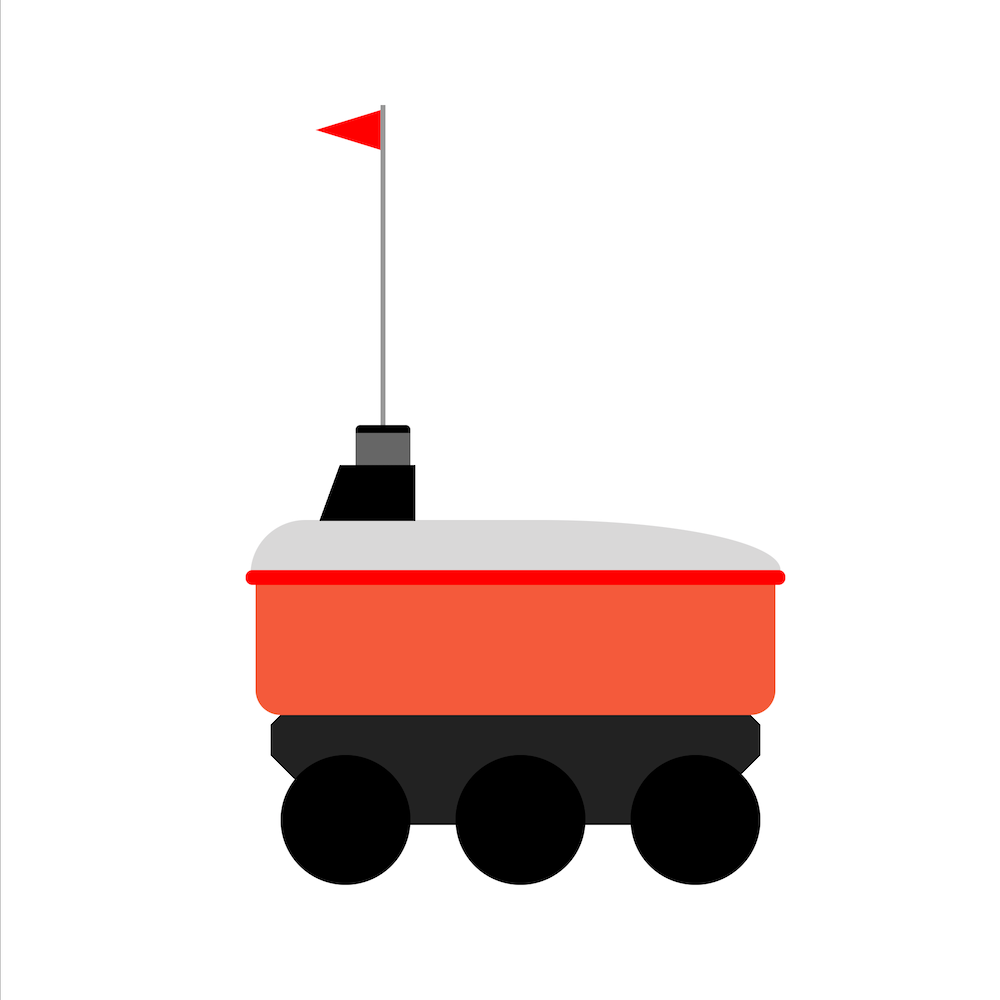

# 2. Яндекс.Тележенька на CSS
 
Вам нужно сверстать картинку 1000 на 1000 пикселей при помощи HTML и CSS. Использовать SVG, встроенные изображения, JavaScript нельзя.



### Формат ввода
```html
<style>  
    /* стили */  
</style>  
<body>  
    <!-- верстка -->  
</body>
```

### Примечания

Для отладки решения используйте инструмент для наложения вёрстки на картинку: https://yadi.sk/d/i_o213fkouFEqA

Вёрстка должна в точности соответствовать изображению (pixel perfect). Все числовые значения в оригинальном решении кратны 5.
Для рисования робота использовались следующие цвета: #f45a3b, #000000, #d8d8d8, #ff0000, #999999, #666666, #222222, #ffffff.